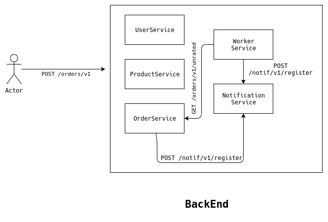

# Design ratings platform

Let's say a customer rents 5 different products (furniture) from CasaOne. We need to capture the ratings from the customer for all of these products after customer starts using the furniture. We also need to display the ratings on the website next to the product. This product rating feature is similar to product ratings on Flipkart and Amazon

Here is what you can submit as part of the assignment

- How will you design the flow. Architecture diagram with an explanation will help. What will the user do and what will the system do?

- Code for API to fetch ratings for the product. This should also return average product rating and count for individual ratings

## Implementation 

- ### Backend - Part 1

  - An architecture with 5 services namely UserService, ProductService, OrderService, NotificationService, WorkerService orchestrated together. The schema of the different services are as follows.
    - Users
      - userId (unique Id of user)
      - userName (display name)
    - Products
      - productId (unique Id of product)
      - productName (display Name)
    - Orders
      - orderId (uniqueId of each order)
      - productId
      - userId
      - orderTime (when the order was made)
      - ratings (defaults to 0)
    - Notifications
      - triggerTime (when to send notification)
      - registeredTime (when notificatin was registered)
      - medium (SMS/Email/Push)
      - notificationType (Welcome/askRating/PaymentReminder)
      - metaData (Data required by notification server)
- ### Flow
  - As soon as the user completes payment and orders a furniture then an event is triggered which creates a notification entry in notification table with type as askRating and it's triggerTime is set to a week after with metaData saved about the user and the product.
  - Then notification service runs every minute to check if there are any noifications to be sent for that minute and it communicates to SMS/Mail/Push APIs to send the notifications of that minute.
  - This process will ensure that notification is sent after a week to user.
  - Then a Worker service can check at end the day about all the entries in ratings table whose value is 0 and orderTime is greater than 1 week. Then the service can create entries in notification service to create the notifications.

- API Journey
  - When user sends a POST requests to /orders/v1, and assuming request succeeds, and the order is placed successfully.
  - An event/HTTP call is generated from OrderService which is caught by Notification service which will register a notification of 1 week later.
  - Let's say daily at 1 PM the worker services asks for the details of orders which has not been rated and it registers those entries in notification service.
